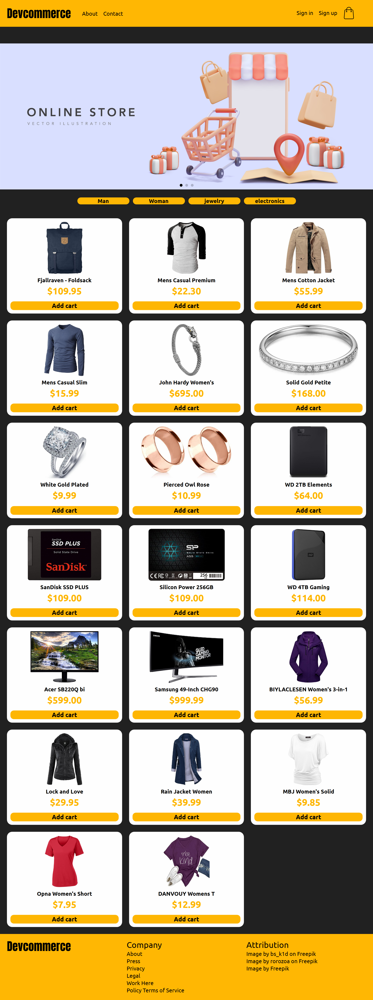

<h1 align="center">
  devcommerce
</h1>

  

## 💻 Projeto

Esse projeto é um e-commerce feito em conjunto com o [Clinton Rocha ](https://github.com/Clintonrocha98). 

## 🚀 Tecnologias

- [HTML](https://developer.mozilla.org/pt-BR/docs/Web/HTML)
- [SASS](https://sass-lang.com/)
- [Vue JS](https://vuejs.org/)
- [Pinia](https://pinia.vuejs.org/)

## 📝 Requisitos do desafio