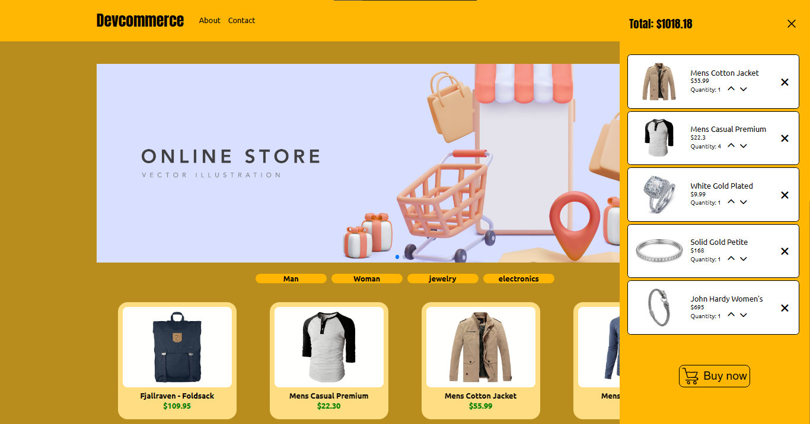

<h1 align="center">
  Devcommerce
</h1>

## 💻 Projeto

Esse projeto é um e-commerce feito em conjunto com o [Clinton Rocha ](https://github.com/Clintonrocha98). Nele usamos a api [Fakestore](https://fakestoreapi.com/), que disponibiliza uma lista completa de produtos, contendo seu preço, imagem, descrição e outros detalhes. As features implementadas nesse projeto são: 

-  Login do usuario
-  Adicioanar produto ao carrinho
-  Finalizar a compra só é possível quando o usuário está logado. 
-  Controle da quantidade de determinado produto no carrinho

<p align="center">
  
</p>

<p align="center">
  
</p>


## 🚀 Tecnologias

- [Vue JS](https://vuejs.org/)
- [Vue Router](https://router.vuejs.org)
- [Pinia](https://pinia.vuejs.org/)
- [SASS](https://sass-lang.com/)
- [HTML](https://developer.mozilla.org/pt-BR/docs/Web/HTML)


## 💻 Como executar o projeto

Para executar o projeto em sua máquina, siga os seguintes passos:

Faça um clone deste repositório em sua máquina:

```
git clone https://github.com/seu-usuario/devcommerce.git
```

Acesse o diretório do projeto:
```
cd devcommerce
```
Instale as dependências do projeto:
```
npm install
```

Acesse o projeto em seu navegador, através do endereço:
```
http://localhost:5173/
```

Lembre-se de que é necessário ter o Node.js e o npm instalados em sua máquina. Se você ainda não os possui, faça o download em [Node](https://nodejs.org/).